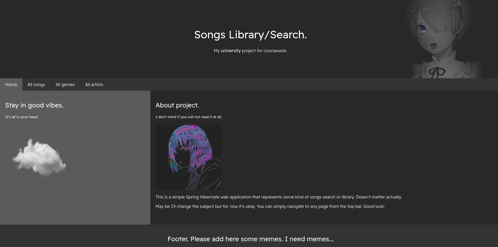

# Study Project - CRUD Spring MVC Songs Library

## Table of contents

- [Overview](#overview)
  - [General Information](#info)
  - [Screenshot](#screenshot)
  - [Links](#links)
- [My process](#my-process)
  - [Built with](#built-with)
  - [What I learned](#what-i-learned)
  - [In plans](#plans)
  - [Useful resources](#useful-resources)
- [Author](#author)

## Overview

### Info

This is once again my coursework from university. Project have almost everything the teachers want from it. 

### Screenshot

### Links

- [Songs Library](https://okay-what-about-this.herokuapp.com/)

## My process

### Built with

- Java Enterprise -> Web App in Intellij IDEA.
- Spring MVC.
- Hibernate.
- TomCat 9. (v10+ doesn't work with javax ([if you really want to use v10+](https://stackoverflow.com/questions/65703840/tomcat-casting-servlets-to-javax-servlet-servlet-instead-of-jakarta-servlet-http/65704617#65704617)))

### What I learned

- MariaDB installation and some basics. (I switched to Linux before teacher's check)
- How phpMyAdmin works with Linux.
- Work with foreign keys in models.
- Heroku deployment. (Ruined my project twice. (: )

### Plans

- Add account-management system and roles. (now everybody can simply create, edit and delete entities from DB.)
- Change design.
- Maybe change subject. Songs Library is kinda weird. 
- Create e-commerce? idk.
- Also I nedd to do something with footer but for now it looks kinda ok.
- Fix adding song from one artist to another in third album.
- Add more columns to already created entities.
- Add here ER-model and logical model, I guess.

### Useful resources

- if you're like me and want to deploy .war - read about it [here](https://devcenter.heroku.com/articles/war-deployment) (for me took around 10 min.)
- [MariaDB in details for my distro](https://wiki.archlinux.org/title/MariaDB) btw...
- [W3 Schools](https://www.w3schools.com/) (used for all HTML and CSS)
- I'm so sorry, I can't remember where I took solution for jsp's proper work with foreign keys. It was Stack Overflow, I guess.

## Author

- Website - [Kami](https://affectionate-benz-e7d220.netlify.app/)
- Telegram - [kam1xgod](https://t.me/kamixgod)
- Mail - [kamixtrash@gmail.com](mailto:kamixtrash@gmail.com)

